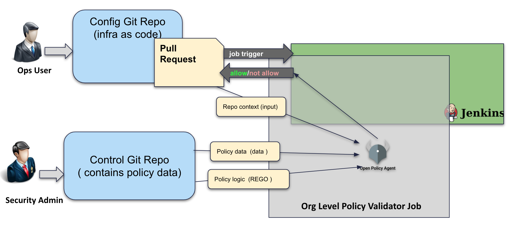
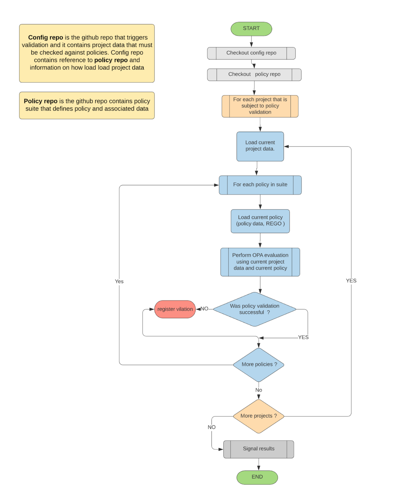

# OPA based policy validation process
## Objectives for developing in-repo policy based validation of Gitops configuration data
### Basic principles of Gitops eco-system:
- Infrastructure state (resourcess, access, configuration etc) is expressed in code
- Change in infrastructure state is Pull Request (PR) against config repository
- When PR is approved the configuration is reflected against live platform to bring it to desired state
### Challenges
- We must protect and assure data quality
- We must make sure that the right people are changing content
- We myst make sure that the right and required people are involved in PR approval process

## Building blocks of OPA policy
- context data 
- policy constrains
- OPA REGO policy logic

Context data is content of config repository, Pull Request data etc.
Policy constrains is definitions in configuration repository that defines policy controls.
REGO file is OpenPolicy Agent declarative policy statement that "makes decision" to allow or not to allow during evaluation of context data and policy constrains at run time.

More on OPA can be found here: http://www.open;olicyagent.org

## In repo policy validation


### Set up of configuration repo
- ```Jenkinsfile.opa``` is a file that must be present in configuration repo and it will refer to control repository that contains policy materials and local configuration file ```opa.yml```
```
cat Jennkinsfile.opa
#! /usr/bin/env groovy
//Jenkinsfile to call linting tests

//calls groovy script in githook-yaml-lint repo
opaKCCGcpResources('https://github.kohls.com/EnterpriseDevOps/cpa-kcc-templates', 'opa', 'opa.yml')
```

- ```opa.yml``` allows to enable/disable policy validation and specify which project data are subject to validation
```
cat opa.yml
---
enabled: true
projectVarFolder: project_vars
validateAllProjects: false # if set to to true, validateProjects is ignored and all projects are validated
validateProjects:
- kohlsdev-cpa-inspec
- kohls-sec-xpn-lle
```

### Setup of control ( or policy )repository
- ```opa``` folder contains policy materials
```
IS-C02S621DG8WP:opa tkmam6x$ ls -la
total 8
drwxr-xr-x   5 tkmam6x  869469075   160 Sep 10 09:52 .
drwxr-xr-x  32 tkmam6x  869469075  1024 Sep 10 09:11 ..
drwxr-xr-x   4 tkmam6x  869469075   128 Sep 10 09:11 data
-rw-r--r--   1 tkmam6x  869469075   518 Sep 10 09:11 policy_suite.yml
drwxr-xr-x   6 tkmam6x  869469075   192 Sep 10 09:11 rego
IS-C02S621DG8WP:opa tkmam6x$ tree
.
├── data
│   ├── iam
│   │   ├── iam-roles-per-project.yml
│   │   ├── iam-roles.yml
│   │   └── validation_manifest.json
│   └── service
│       ├── apis-per-project.yml
│       ├── apis.yml
│       └── validation_manifest.json
├── policy_suite.yml
└── rego
    ├── iam-roles.rego
    ├── iam-roles_test.rego
    ├── service-apis.rego
    └── service-apis_test.rego
```
- ```opa/policy_suite.yml``` contains definitions of individual policies
```
$ cat policy_suite.yml 
---
policies:
- name: "Users, Groups and Service Accounts are only given allowed roles"
  active: true
  policyDataFiles:
  - data/iam/iam-roles.yml
  - data/iam/iam-roles-per-project.yml
  policyRegoFile: rego/iam-roles.rego
  package: "kohls.gitops.kcc.gcp_project.iam.roles"
- name: "Only allow whitelisted Service APIs"
  active: true
  policyDataFiles:
  - data/service/apis.yml
  - data/service/apis-per-project.yml
  policyRegoFile: rego/service-apis.rego
  package: "kohls.gitops.kcc.gcp_project.service.apis"
```


### Validation process



## Simulated run of opa valiation
Opa validation is performed as in-repo organization linter job.
It is possible to "deconstruct" Jenkins runtime environment into your workstation  and perform evaluation and validation without Jenkins and without doing pull requests, commits etc. Bellow are the simple steps you can follow:
### Checkout prerequisite repos
- Clone template repo
```git clone https://gitlab.com/kohls/infra/platform_enablement/cloud-config/cloud-resources.git```
- Clone config repo
```git clone https://gitlab.com/kohls/infra/platform_enablement/cloud-config/gcp-config.git```
- Clone linter repo
```git clone https://gitlab.com/kohls/sre/infra/githook-yaml-lint.git```

### Install and activate proper python environment
```
virtualenv -p python3 venv
source vevn/bin/activate
pip install -r githook-yaml-lint/resources/opa_validation/requirements.txt 
```

### Download opa binary ( example is for OS-X)
```
curl -L -o opa https://openpolicyagent.org/downloads/latest/opa_darwin_amd64
chmod 755 opa
```

## Run validation
- Navigate to **opa** folder in template repo
```cd config-resources/opa/```

- Execute validation:
```
 python ../../githook-yaml-lint/resources/opa_validation/opa_linter.py  --opa_config=../../gcp-config/opa.yml --opa_binary=../../opa --opa_runner=../../githook-yaml-lint/resources/opa_validation/opa_run.py  --opa_suite_definition=./policy_suite.yml --log=./opa.log --report_file=./report.txt
```
- Check results:
```
cat ./report.txt
******* Validating policies for project kohls-sec-xpn-lle *********
Policy 'Users, Groups and Service Accounts are only given allowed roles' ---> passed
Policy 'Only allow whitelisted Service APIs' ---> FAILED
------------------------------------------------------------------------
```

```
cat ./opa.log
2020-09-10 09:13:50,175  INFO: Loaded OPA validation config
2020-09-10 09:13:50,176  INFO: Processing project data for kohls-sec-xpn-lle
2020-09-10 09:13:50,176  INFO: Processing input data for /Users/tkmam6x/VSC_Projects/CPA-2990/DELETEME/gcp-config/project_vars/kohls-sec-xpn-lle
2020-09-10 09:13:50,621  INFO: Processing policy 'Users, Groups and Service Accounts are only given allowed roles'
2020-09-10 09:13:50,922  INFO: OPA evaluation compeleted
2020-09-10 09:13:50,922  INFO: Result set. START
2020-09-10 09:13:50,922  INFO: {
  "result": [
    {
      "expressions": [
        {
          "value": {
            "allow": true,
            "allowed_group_roles": [
              "bigquery.admin",
              "bigquery.dataEditor",
              "bigquery.dataOwner",
              "bigquery.dataViewer",
              "bigquery.jobUser",
              "bigquery.metadataViewer",
              "bigquery.readSessionUser",
              "bigquery.user",
              "bigtable.admin",
              "bigtable.reader",
              "bigtable.user",
              "bigtable.viewer",
              "browser",
              "cloudbuild.builds.builder",
              "cloudbuild.builds.editor",
              "cloudbuild.builds.viewer",
              "datastore.importExportAdmin",
              "datastore.indexAdmin",
              "datastore.owner",
              "datastore.user",
              "datastore.viewer",
              "cloudfunctions.admin",
              "cloudfunctions.developer",
              "cloudfunctions.viewer",
              "redis.admin",
              "redis.editor",
              "redis.viewer",
              "cloudscheduler.admin",
              "cloudscheduler.viewer",
              "spanner.admin",
              "spanner.databaseAdmin",
              "spanner.databaseReader",
              "spanner.databaseUser",
              "spanner.viewer",
              "cloudsql.admin",
              "cloudsql.editor",
              "cloudtrace.admin",
              "cloudtrace.user",
              "compute.imageUser",
              "compute.instanceAdmin.v1",
              "compute.loadBalancerAdmin",
              "compute.networkUser",
              "compute.networkViewer",
              "compute.osLogin",
              "compute.storageAdmin",
              "compute.viewer",
              "dataflow.admin",
              "dataflow.developer",
              "dataflow.viewer",
              "dataflow.worker",
              "dataprep.projects.user",
              "dataproc.editor",
              "dataproc.viewer",
              "deploymentmanager.editor",
              "deploymentmanager.typeEditor",
              "deploymentmanager.typeViewer",
              "deploymentmanager.viewer",
              "dialogflow.admin",
              "dialogflow.client",
              "dialogflow.reader",
              "errorreporting.admin",
              "errorreporting.user",
              "errorreporting.viewer",
              "errorreporting.writer",
              "firebase.admin",
              "firebase.analyticsAdmin",
              "firebase.analyticsViewer",
              "firebasecrashlytics.admin",
              "firebasecrashlytics.viewer",
              "firebase.developAdmin",
              "firebase.developViewer",
              "firebase.growthAdmin",
              "firebase.growthViewer",
              "firebase.viewer",
              "container.admin",
              "container.clusterAdmin",
              "container.developer",
              "container.viewer",
              "logging.admin",
              "logging.configWriter",
              "logging.viewer",
              "logging.logWriter",
              "ml.admin",
              "ml.developer",
              "ml.viewer",
              "monitoring.admin",
              "monitoring.editor",
              "monitoring.metricWriter",
              "monitoring.viewer",
              "logging.privateLogViewer",
              "pubsub.admin",
              "pubsub.editor",
              "pubsub.publisher",
              "pubsub.subscriber",
              "pubsub.viewer",
              "servicemanagement.quotaAdmin",
              "servicemanagement.quotaViewer",
              "iam.serviceAccountKeyAdmin",
              "iam.serviceAccountTokenCreator",
              "iam.serviceAccountUser",
              "storage.admin",
              "storage.objectAdmin",
              "storage.objectCreator",
              "storage.objectViewer",
              "storagetransfer.user",
              "storagetransfer.viewer",
              "viewer"
            ],
            "allowed_group_roles_general": [
              "bigquery.admin",
              "bigquery.dataEditor",
              "bigquery.dataOwner",
              "bigquery.dataViewer",
              "bigquery.jobUser",
              "bigquery.metadataViewer",
              "bigquery.readSessionUser",
              "bigquery.user",
              "bigtable.admin",
              "bigtable.reader",
              "bigtable.user",
              "bigtable.viewer",
              "browser",
              "cloudbuild.builds.builder",
              "cloudbuild.builds.editor",
              "cloudbuild.builds.viewer",
              "datastore.importExportAdmin",
              "datastore.indexAdmin",
              "datastore.owner",
              "datastore.user",
              "datastore.viewer",
              "cloudfunctions.admin",
              "cloudfunctions.developer",
              "cloudfunctions.viewer",
              "redis.admin",
              "redis.editor",
              "redis.viewer",
              "cloudscheduler.admin",
              "cloudscheduler.viewer",
              "spanner.admin",
              "spanner.databaseAdmin",
              "spanner.databaseReader",
              "spanner.databaseUser",
              "spanner.viewer",
              "cloudsql.admin",
              "cloudsql.editor",
              "cloudtrace.admin",
              "cloudtrace.user",
              "compute.imageUser",
              "compute.instanceAdmin.v1",
              "compute.loadBalancerAdmin",
              "compute.networkUser",
              "compute.networkViewer",
              "compute.osLogin",
              "compute.storageAdmin",
              "compute.viewer",
              "dataflow.admin",
              "dataflow.developer",
              "dataflow.viewer",
              "dataflow.worker",
              "dataprep.projects.user",
              "dataproc.editor",
              "dataproc.viewer",
              "deploymentmanager.editor",
              "deploymentmanager.typeEditor",
              "deploymentmanager.typeViewer",
              "deploymentmanager.viewer",
              "dialogflow.admin",
              "dialogflow.client",
              "dialogflow.reader",
              "errorreporting.admin",
              "errorreporting.user",
              "errorreporting.viewer",
              "errorreporting.writer",
              "firebase.admin",
              "firebase.analyticsAdmin",
              "firebase.analyticsViewer",
              "firebasecrashlytics.admin",
              "firebasecrashlytics.viewer",
              "firebase.developAdmin",
              "firebase.developViewer",
              "firebase.growthAdmin",
              "firebase.growthViewer",
              "firebase.viewer",
              "container.admin",
              "container.clusterAdmin",
              "container.developer",
              "container.viewer",
              "logging.admin",
              "logging.configWriter",
              "logging.viewer",
              "logging.logWriter",
              "ml.admin",
              "ml.developer",
              "ml.viewer",
              "monitoring.admin",
              "monitoring.editor",
              "monitoring.metricWriter",
              "monitoring.viewer",
              "logging.privateLogViewer",
              "pubsub.admin",
              "pubsub.editor",
              "pubsub.publisher",
              "pubsub.subscriber",
              "pubsub.viewer",
              "servicemanagement.quotaAdmin",
              "servicemanagement.quotaViewer",
              "iam.serviceAccountKeyAdmin",
              "iam.serviceAccountTokenCreator",
              "iam.serviceAccountUser",
              "storage.admin",
              "storage.objectAdmin",
              "storage.objectCreator",
              "storage.objectViewer",
              "storagetransfer.user",
              "storagetransfer.viewer",
              "viewer"
            ],
            "allowed_group_roles_per_project": [],
            "allowed_sa_roles": [
              "bigquery.admin",
              "bigquery.dataEditor",
              "bigquery.dataOwner",
              "bigquerydatatransfer.serviceAgent",
              "bigquery.dataViewer",
              "bigquery.jobUser",
              "bigquery.metadataViewer",
              "bigquery.readSessionUser",
              "bigquery.user",
              "bigtable.admin",
              "bigtable.reader",
              "bigtable.user",
              "bigtable.viewer",
              "browser",
              "cloudbuild.builds.builder",
              "cloudbuild.builds.editor",
              "cloudbuild.builds.viewer",
              "dataflow.serviceAgent",
              "datastore.importExportAdmin",
              "datastore.indexAdmin",
              "datastore.owner",
              "datastore.user",
              "datastore.viewer",
              "cloudfunctions.admin",
              "cloudfunctions.developer",
              "cloudfunctions.serviceAgent",
              "cloudfunctions.viewer",
              "redis.admin",
              "redis.editor",
              "redis.serviceAgent",
              "redis.viewer",
              "ml.serviceAgent",
              "cloudscheduler.admin",
              "cloudscheduler.viewer",
              "sourcerepo.serviceAgent",
              "spanner.admin",
              "spanner.databaseAdmin",
              "spanner.databaseReader",
              "spanner.databaseUser",
              "spanner.viewer",
              "cloudsql.admin",
              "cloudsql.editor",
              "cloudtrace.admin",
              "cloudtrace.agent",
              "cloudtrace.user",
              "compute.imageUser",
              "compute.instanceAdmin.v1",
              "compute.loadBalancerAdmin",
              "compute.networkUser",
              "compute.networkViewer",
              "compute.osLogin",
              "compute.storageAdmin",
              "compute.viewer",
              "dataflow.admin",
              "dataflow.developer",
              "dataflow.viewer",
              "dataflow.worker",
              "dataprep.serviceAgent",
              "dataprep.projects.user",
              "dataproc.editor",
              "dataproc.serviceAgent",
              "dataproc.viewer",
              "dataproc.worker",
              "deploymentmanager.editor",
              "deploymentmanager.typeEditor",
              "deploymentmanager.typeViewer",
              "deploymentmanager.viewer",
              "dialogflow.admin",
              "dialogflow.client",
              "dialogflow.reader",
              "errorreporting.admin",
              "errorreporting.user",
              "errorreporting.viewer",
              "errorreporting.writer",
              "firebase.admin",
              "firebase.analyticsAdmin",
              "firebase.analyticsViewer",
              "firebasecrashlytics.admin",
              "firebasecrashlytics.viewer",
              "firebase.developAdmin",
              "firebase.developViewer",
              "firebase.growthAdmin",
              "firebase.growthViewer",
              "firebase.viewer",
              "container.admin",
              "container.clusterAdmin",
              "container.developer",
              "container.viewer",
              "logging.admin",
              "logging.configWriter",
              "logging.viewer",
              "logging.logWriter",
              "ml.admin",
              "ml.developer",
              "ml.viewer",
              "monitoring.admin",
              "monitoring.editor",
              "monitoring.metricWriter",
              "monitoring.viewer",
              "logging.privateLogViewer",
              "pubsub.admin",
              "pubsub.editor",
              "pubsub.publisher",
              "pubsub.subscriber",
              "pubsub.viewer",
              "servicemanagement.quotaAdmin",
              "servicemanagement.quotaViewer",
              "iam.serviceAccountUser",
              "storage.admin",
              "storage.objectAdmin",
              "storage.objectCreator",
              "storage.objectViewer",
              "storagetransfer.user",
              "storagetransfer.viewer",
              "viewer"
            ],
            "allowed_sa_roles_general": [
              "bigquery.admin",
              "bigquery.dataEditor",
              "bigquery.dataOwner",
              "bigquerydatatransfer.serviceAgent",
              "bigquery.dataViewer",
              "bigquery.jobUser",
              "bigquery.metadataViewer",
              "bigquery.readSessionUser",
              "bigquery.user",
              "bigtable.admin",
              "bigtable.reader",
              "bigtable.user",
              "bigtable.viewer",
              "browser",
              "cloudbuild.builds.builder",
              "cloudbuild.builds.editor",
              "cloudbuild.builds.viewer",
              "dataflow.serviceAgent",
              "datastore.importExportAdmin",
              "datastore.indexAdmin",
              "datastore.owner",
              "datastore.user",
              "datastore.viewer",
              "cloudfunctions.admin",
              "cloudfunctions.developer",
              "cloudfunctions.serviceAgent",
              "cloudfunctions.viewer",
              "redis.admin",
              "redis.editor",
              "redis.serviceAgent",
              "redis.viewer",
              "ml.serviceAgent",
              "cloudscheduler.admin",
              "cloudscheduler.viewer",
              "sourcerepo.serviceAgent",
              "spanner.admin",
              "spanner.databaseAdmin",
              "spanner.databaseReader",
              "spanner.databaseUser",
              "spanner.viewer",
              "cloudsql.admin",
              "cloudsql.editor",
              "cloudtrace.admin",
              "cloudtrace.agent",
              "cloudtrace.user",
              "compute.imageUser",
              "compute.instanceAdmin.v1",
              "compute.loadBalancerAdmin",
              "compute.networkUser",
              "compute.networkViewer",
              "compute.osLogin",
              "compute.storageAdmin",
              "compute.viewer",
              "dataflow.admin",
              "dataflow.developer",
              "dataflow.viewer",
              "dataflow.worker",
              "dataprep.serviceAgent",
              "dataprep.projects.user",
              "dataproc.editor",
              "dataproc.serviceAgent",
              "dataproc.viewer",
              "dataproc.worker",
              "deploymentmanager.editor",
              "deploymentmanager.typeEditor",
              "deploymentmanager.typeViewer",
              "deploymentmanager.viewer",
              "dialogflow.admin",
              "dialogflow.client",
              "dialogflow.reader",
              "errorreporting.admin",
              "errorreporting.user",
              "errorreporting.viewer",
              "errorreporting.writer",
              "firebase.admin",
              "firebase.analyticsAdmin",
              "firebase.analyticsViewer",
              "firebasecrashlytics.admin",
              "firebasecrashlytics.viewer",
              "firebase.developAdmin",
              "firebase.developViewer",
              "firebase.growthAdmin",
              "firebase.growthViewer",
              "firebase.viewer",
              "container.admin",
              "container.clusterAdmin",
              "container.developer",
              "container.viewer",
              "logging.admin",
              "logging.configWriter",
              "logging.viewer",
              "logging.logWriter",
              "ml.admin",
              "ml.developer",
              "ml.viewer",
              "monitoring.admin",
              "monitoring.editor",
              "monitoring.metricWriter",
              "monitoring.viewer",
              "logging.privateLogViewer",
              "pubsub.admin",
              "pubsub.editor",
              "pubsub.publisher",
              "pubsub.subscriber",
              "pubsub.viewer",
              "servicemanagement.quotaAdmin",
              "servicemanagement.quotaViewer",
              "iam.serviceAccountUser",
              "storage.admin",
              "storage.objectAdmin",
              "storage.objectCreator",
              "storage.objectViewer",
              "storagetransfer.user",
              "storagetransfer.viewer",
              "viewer"
            ],
            "allowed_sa_roles_per_project": [],
            "allowed_user_roles": [],
            "allowed_user_roles_general": [],
            "allowed_user_roles_per_project": [],
            "environment": "lle",
            "group_roles": [],
            "project_id": "kohls-sec-xpn-lle",
            "requested_group_roles": [],
            "requested_sa_roles": [],
            "requested_user_roles": [],
            "sa_roles": [],
            "user_roles": []
          },
          "text": "data.kohls.gitops.kcc.gcp_project.iam.roles",
          "location": {
            "row": 1,
            "col": 1
          }
        }
      ]
    }
  ]
}

2020-09-10 09:13:50,922  INFO: Result set. END
2020-09-10 09:13:50,922  INFO: >>>>>>>>> 'Users, Groups and Service Accounts are only given allowed roles' ALLOWED
2020-09-10 09:13:50,922  INFO: Processing policy 'Only allow whitelisted Service APIs'
2020-09-10 09:13:51,088  INFO: OPA evaluation compeleted
2020-09-10 09:13:51,089  INFO: Result set. START
2020-09-10 09:13:51,089  INFO: {
  "result": [
    {
      "expressions": [
        {
          "value": {
            "allow": false,
            "allowed_service_apis": [
              "cloudresourcemanager.googleapis.com",
              "storage-api.googleapis.com",
              "storage-component.googleapis.com",
              "stackdriver.googleapis.com",
              "compute.googleapis.com"
            ],
            "allowed_service_apis_per_env": [
              "cloudresourcemanager.googleapis.com",
              "storage-api.googleapis.com",
              "storage-component.googleapis.com",
              "stackdriver.googleapis.com",
              "compute.googleapis.com"
            ],
            "allowed_service_apis_per_project": [],
            "environment": "lle",
            "project_id": "kohls-sec-xpn-lle",
            "requested_service_apis": [
              "cloudresourcemanager.googleapis.com",
              "monitoring.googleapis.com",
              "oslogin.googleapis.com",
              "storage-api.googleapis.com",
              "stackdriver.googleapis.com",
              "storage-component.googleapis.com",
              "cloudasset.googleapis.com",
              "compute.googleapis.com",
              "container.googleapis.com",
              "logging.googleapis.com"
            ]
          },
          "text": "data.kohls.gitops.kcc.gcp_project.service.apis",
          "location": {
            "row": 1,
            "col": 1
          }
        }
      ]
    }
  ]
}

2020-09-10 09:13:51,089  INFO: Result set. END
2020-09-10 09:13:51,089  ERROR: >>>>>>>> 'Only allow whitelisted Service APIs' NOT ALLOWED
2020-09-10 09:13:51,104  ERROR: Exited with code 1
2020-09-10 09:13:51,104  INFO: Some of policy checks were not OK
```

