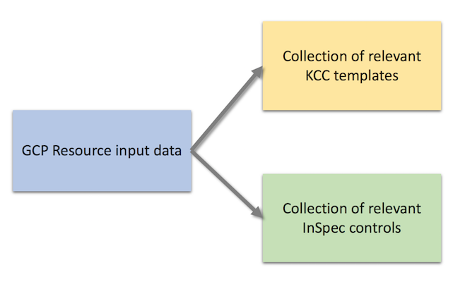
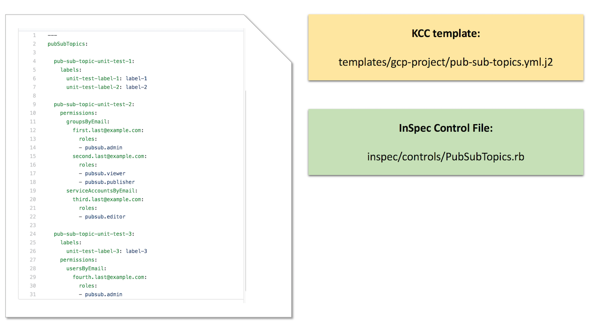
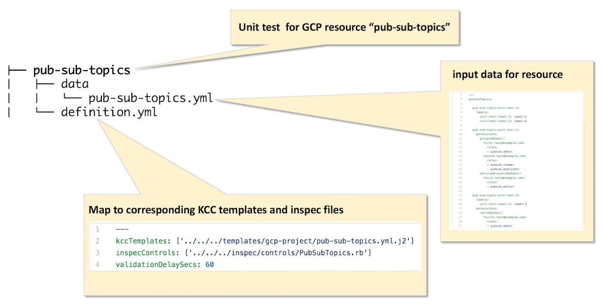
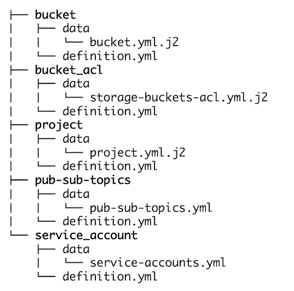
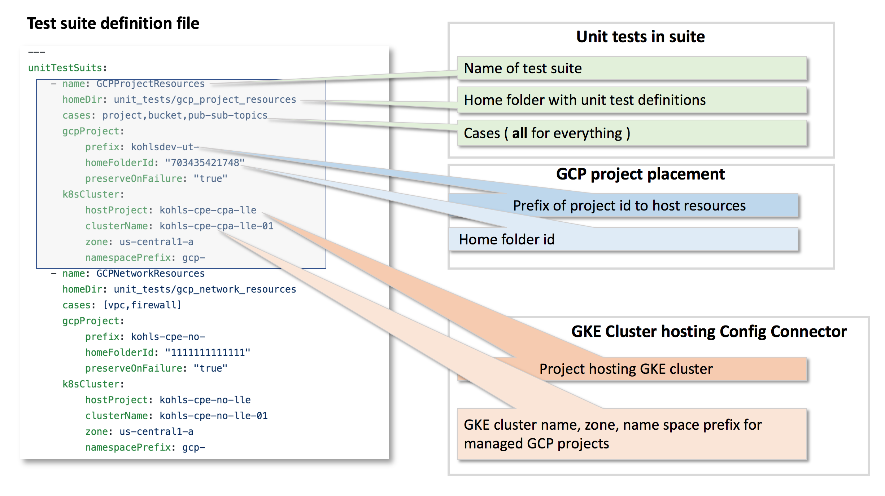
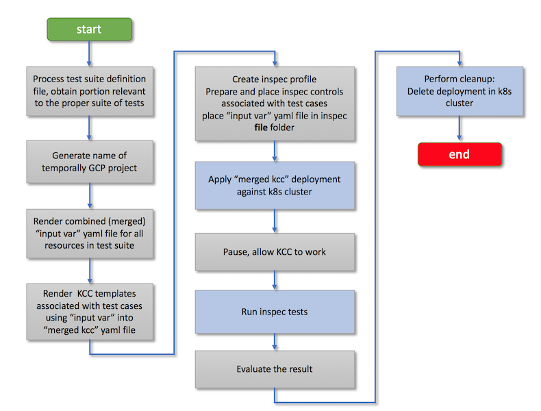

# KCC GCP Resource Unit Test Processing

## Objectives of Unit Test Processing
- Provide data driven unit test cases validation environment
- Allow aggregation of unit test cases into named test suites
- Allow to associate test suites with various k8s runtime environments
- Execute test cases in context of dynamic, just in time created, GCP project space
- Use InSpec GCP for validation

## Unit Test Case Data Design
### Single Unit Test Case Data attributes
Unit is represented by the following independent entitites
- Definition of resource. This is sinlge or multipe files in YAML format that represent desired GCP resource in context of proper project. Those files are representing a given resource the same way YAML content represents collection of resources in **gcp-config** repository in **project_vars** folder. Those yaml files can have **arbitrary** names and it is possile to have sinlge or many files representing resource or mutliple resources of the same type. 
- KCC template(s) that, when rendered with YAML definition of the resource, will produce valid ConfigConnector definition that can be applied to k8s. The KCC template must be one of the templates stored in **cloud-resources** repository in **templates/gcp-project** folder
- InSpec control file(s) that, when associated with with YAML definition of the resource, can be used to validate the resource and its attributes against proper project space.

**Unit Test Case Attributes**



## What a given unit test associated with GCP resource is covering ?
- validates ability to correctly define resource using various combination of input data elements
- validates correctness of KCC template(s) associated with resource
- validates correctness of InSpec control(s) associated with resource


### Unit Test Case Attributes - in more detail
**Unit Test Case Attributes, more detailed**




#### Representation of a single unit test case in file system
- The name of unit test case will be used to name the folder that will contain definitions and references
- Folder **data** will contain one or many YAML files representing resource
- **definition.yml** contains references to KCC templates and InSpec control files

**Example of single unit test case named 'pub-sub-topics'**


#### Representation of multiple unit test cases in file system
Since the name of unit test is unique all unit tests can be placed on the same folder level on the file system


#### Globally named resources
Some of the GCP resources requires naming with global scope. To accomodate this a minimal templating is allowed in resource definitions. Any file with .j2 extension in **data** folder of unit test definition will be rendered with backing data with the following attributes

| Attribute  | Description |
| ------------- | ------------- |
| project.name  |  GCP project id created at the run time. ( It consists of prefix defined in test suite definition **gcpProject.prefix** and unique, date/time bound suffix ) For example  **gcp-domsdev-ut-202005181009567621** |
| project.folderId  |  matches value defined in **gcpProject.homeFolderId** from suite definition. For example **"703435421748"**|

**Example of bucket unit test definition with global name support**

File structure:
```
├── bucket
│   ├── data
│   │   └── bucket.yml.j2
│   └── definition.yml
```

Content of bucket/data/bucket.yml.j2
```yaml
storageBuckets:
  {{ project.name }}-01:
    versioningEnabled: false
    labels:
      versioning: "false"
      line-of-business: cpe

  {{ project.name }}-02:
    versioningEnabled: true
    labels:
      versioning: "true"
      app-name: kcc
```

#### Injection of additional data outside of unit test definition
To support default vars and data elemets defined at line of business level etcit is possible to place additional YAML content at the level of unit test directoroes in folders begining with underscore. Such content will be "merged" into final 'input var' content.
For example, the following unit test suite defines unit tests for bucket, bucket_acl, project, pub-sub-topics and service_account and it stores additonal content in **_common_vars** folder

```
├── _common_vars
│   └── default-labels.yml
├── bucket
│   ├── data
│   │   └── bucket.yml.j2
│   └── definition.yml
├── bucket_acl
│   ├── data
│   │   └── storage-buckets-acl.yml.j2
│   └── definition.yml
├── project
│   ├── data
│   │   └── project.yml.j2
│   └── definition.yml
├── pub-sub-topics
│   ├── data
│   │   └── pub-sub-topics.yml
│   └── definition.yml
└── service_account
    ├── data
    │   └── service-accounts.yml
    └── definition.yml
```

Sample content of _common_vars/default-labels.yml
```yml
---
defaultLabels:
  unit-test-label-1: should-be-overwritten
  unit-test-label: default-unit-test-label
```


## Unit Test Suite
The intention of test suite is to 
- create named association of relevant test cases stored in the same folder 
- associate run time environment that supports ConfigConnector that will be used to deploy resources against those test cases
- specify parameters for creation of ephemeral temporarily project that will be hosting resources supporting unit test cases

Such definition is represented in YAML file and stored in the same repository that contains unit test cases definitions.
Unit test suite definition file can be referenced to from processing "marker" Jenkins file along with suite name or names that need to be executed.

**Example of unit test suites definition**


## Processing
The processor is given name of test suite definition file and name of suite that needs to be run.
The test suite is always bound to a single run time GKE environment and  **a single ephemeral project** will be created in dedicated k8s name space to host tested resources. At the end of processing the resournces and name space will be destroyed.

**Processing workflow**



**Desription of Processor Steps**
- receives the following pieces of informatio from automation:
  - name of file containing test suite definition
  - name of test suite
- generates name of for new GCP project to host unit tests. The name is comprised of **gcpProject.prefix** and date/time string with milisecond precision
- renders and merges  definitions for test unit cases in sinlge 'input var' file
- renders and merges KCC templates witn date from 'input var' file  into  'merged kcc' file. This file is a valid ConfigConnector deployment
- creates new InSpec profile and initialises it with the following:
  - 'input var' file
  - control files associated with unit cases in unit test suite
- applies 'merged kcc' deployment agains k8s cluster specified in **k8sCluster.clusterName** definition of unit test suite
- pauses, allowing CC to create and settle down resources in newly created project space
- executes inspec tests, captures the result
- performs cleanup destroying deployment

## Unit Test Coverage
It is a good idea to estimate **"coverage"** of inspec control files and KCC templates by test cases.
This could be done in repo as static analysis. The algorythm for such analysis would be to build a list of Inspec control files and KCC templates associated with **all enabled** test case in **all test suites**  and compare it to full list of Inspec control files and KCC templates. The closer coverage to 100% the more assurance we have that unit tests are "touching" as many  Inspec and KCC templates as possible during unit test processing run.
Such simple coverage estimator is **unit_tests/coverage.py**

Bellow is an example output of **coverage.py** script:
```
(vevn) bash-3.2$ python unit_tests/coverage.py unit_tests/unit_tests_suits.yml 

--------------------------------------------------------------
**** KCC Templates Coverage: 22% ****
--------------------------------------------------------------
vpcVPNTunnelSideB.yml.j2 NOT COVERED
vpcVPNRouterNat.yml.j2 NOT COVERED
iam-policy-members.yml.j2: OK
pub-sub-topics.yml.j2: OK
vpcNetworks.yml.j2 NOT COVERED
vpcVPNRouterBGPSideB.yml.j2 NOT COVERED
service-usage.yml.j2: OK
project.yml.j2: OK
vpcPeering.yml.j2 NOT COVERED
pub-sub-subscriptions.yml.j2 NOT COVERED
storage-buckets-acl.yml.j2 NOT COVERED
big-query-dataset.yml.j2 NOT COVERED
iam-service-accounts.yml.j2 NOT COVERED
vpcFirewalls.yml.j2 NOT COVERED
vpcPIRouter.yml.j2 NOT COVERED
storage-buckets.yml.j2: OK
vpcVPNRouterBGPSideA.yml.j2 NOT COVERED
vpcSharing.yml.j2 NOT COVERED
vpcVPNTunnelSideA.yml.j2 NOT COVERED
vpcVPNRouter.yml.j2 NOT COVERED
container-cluster.yml.j2 NOT COVERED
iam-policy-subnets.yml.j2 NOT COVERED
storage-default-object-acls.yml.j2 NOT COVERED

--------------------------------------------------------------
**** Inspec Controls Coverage: 16% ****
--------------------------------------------------------------
IAMPolicySubnets.rb NOT COVERED
BigQueryDataset.rb NOT COVERED
Project.rb: OK
PubSubSubscriptions.rb NOT COVERED
vpcFirewall.rb NOT COVERED
IAM_Bindings.rb NOT COVERED
ProjectService.rb NOT COVERED
vpcVPNRouterNat.rb NOT COVERED
PubSubTopicsIAM.rb NOT COVERED
ContainerCluster.rb NOT COVERED
StorageDefaultObjectAcls.rb NOT COVERED
vpcVPNRouter.rb NOT COVERED
IAMServiceAccounts.rb NOT COVERED
PubSubTopics.rb: OK
vpcVPNTunnels.rb NOT COVERED
StorageBuckets.rb: OK
vpcNetwork.rb NOT COVERED
StorageBucketsACL.rb NOT COVERED
Labels.rb NOT COVERED
(vevn) bash-3.2$ 
``` 
